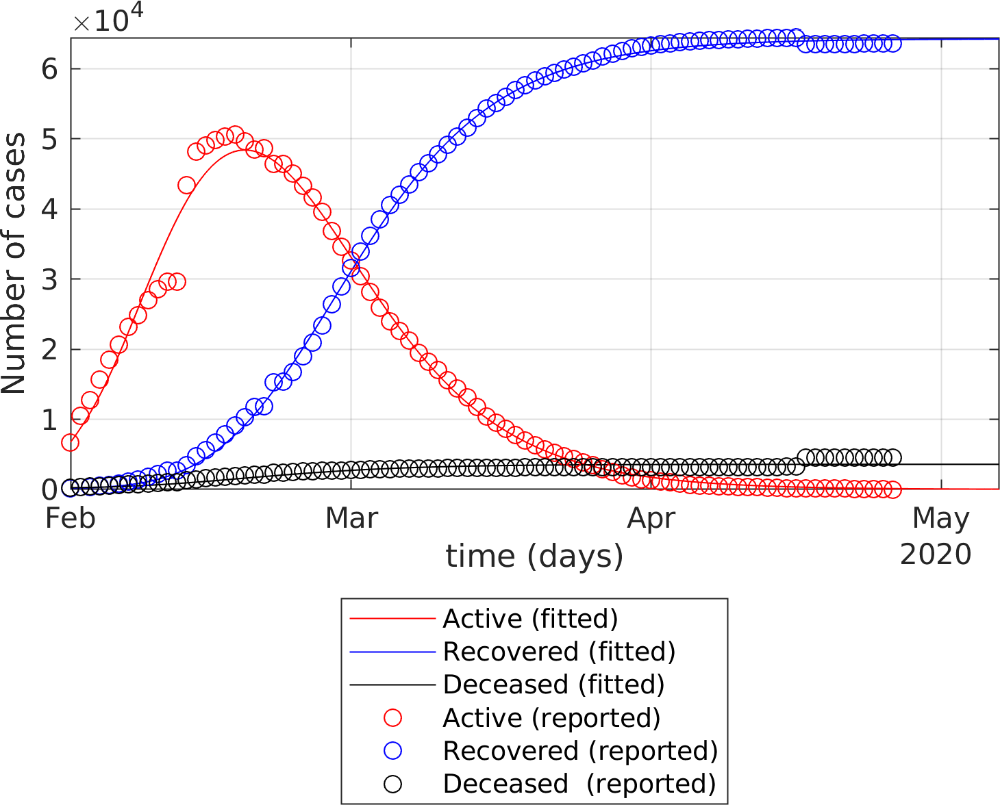
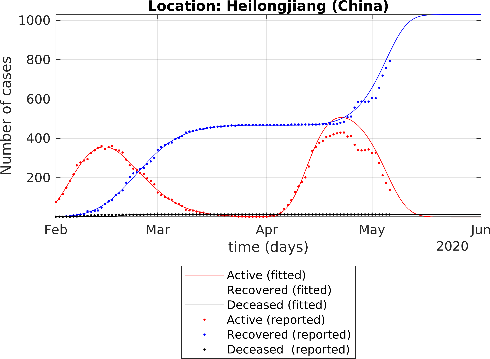

# Generalized SEIR Epidemic Model (fitting and computation)

## Description
A generalized SEIR model with seven states [2] is numerically implemented. The implementation is done from scratch except for the fitting, that relies on the function "lsqcurvfit". Therefore, the present implementation likely differs from the one used in ref.[2].

This Matlab implementation includes also some major differences with respect to ref. [2]. Among them is the expression of the death rate and recovery rate, which are analytical and empirical functions of the time. The idea behind this time-dependency is that the death and recovery rate should converge toward a constant value as the time increases. If the death rate is kept constant, the number of death may be overestimated. Births and natural death are not modelled here. This means that the total population, including the number of deceased cases, is kept constant. Note that ref. [2] is a preprint that is not peer-reviewed and I am not qualified enough to judge the quality of the paper.

## Content
The present submission contains:
- A function SEIQRDP.m that is used to simulate the time histories of the infectious, recovered and dead cases (among others)
- A function fit_SEIQRDP.m that estimates the ten parameters used in SEIQRDP.m in the least square sense.
- One example file Documentation.mlx, which presents the numerical implementation.
- One example file Example_province_region.mlx, which uses data collected by the Johns Hopkins University for the COVID-19 epidemy [3] for Hubei province (China).
- One example file Example_Country.mlx, which uses data collected by the Johns Hopkins University for the COVID-19 epidemy [3] for a coutnry.
- One file "ItalianRegions.mlx" written by Matteo Secli (https://github.com/matteosecli) that I have modified for a slightly more robust fitting.
- One example file ChineseProvinces.mlx, which illustrates how the function fit_SEIQRDP.m is used in a for loop to be fitted to the data [3] from the different Chinese provinces.
- One example "uncertaintiesIssues.mlx", which illustrates the danger of fitting limited data sets.
- One example "Example_US_cities.mlx" that illustrates the fitting when "recovered" data are not available.
- One example simulateMultipleWaves,mlx that illustrates the fitting for multiple epidemic waves.

- One function getDataCOVID, which read from [3] the data collected by Johns Hopkins University.
- One function getDataCOVID_ITA written by Matteo Secli (https://github.com/matteosecli), that collects the updated data of the COVID-19 pandemic in Italy from the Italian government [4]
- One function getDataCOVID_US that collects the updated data in the USA from [3]
- One function checkRates.m that plots the fitted and computed death and recovery rates (quality check)
- One function getMultipleWaves.m that simulate and fit the SEIRQDP model to the situations where multiple epidemic waves are detected.

Any question, comment or suggestion is welcome.

## References

[1] https://en.wikipedia.org/wiki/Compartmental_models_in_epidemiology#Bio-mathematical_deterministic_treatment_of_the_SIR_model

[2] Peng, L., Yang, W., Zhang, D., Zhuge, C., & Hong, L. (2020). Epidemic analysis of COVID-19 in China by dynamical modeling. arXiv preprint arXiv:2002.06563.

[3] https://github.com/CSSEGISandData/COVID-19

[4] https://github.com/pcm-dpc/COVID-19

## Example 1 (case of COVID-19 in Italy) 

The fitting of the extended SEIR model to real data provides the following results:

## Example 2 (case of COVID-19 in Hubei) 

The fitting of the extended SEIR model to real data provides the following results:

## Example 3 (case of multiple waves) 

The fitting of the extended SEIR model to real data provides the following results:

